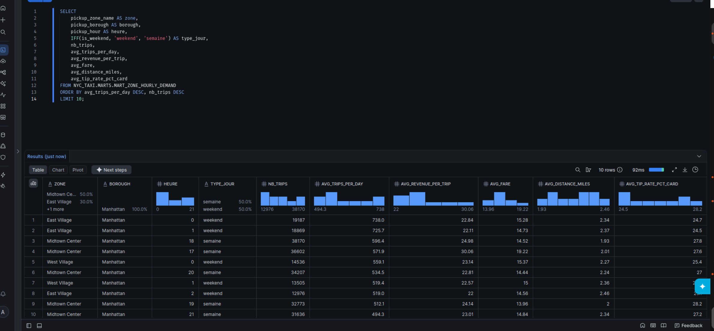
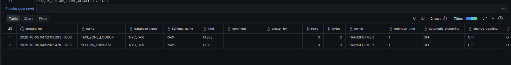
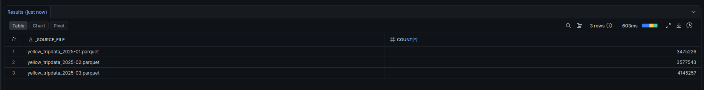
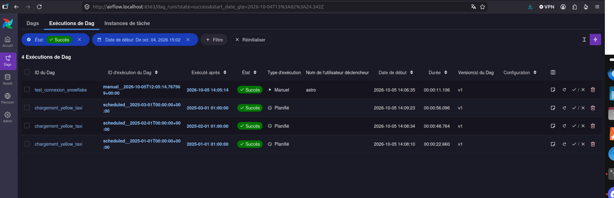
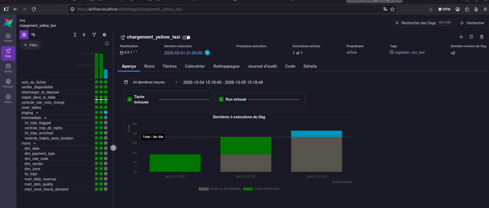
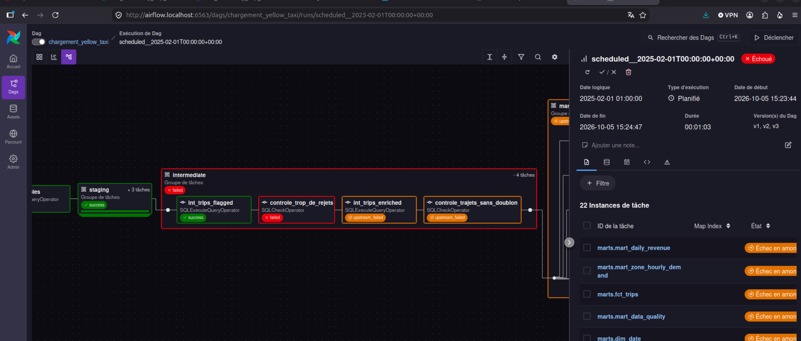
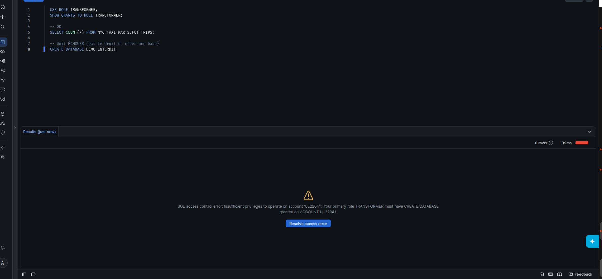
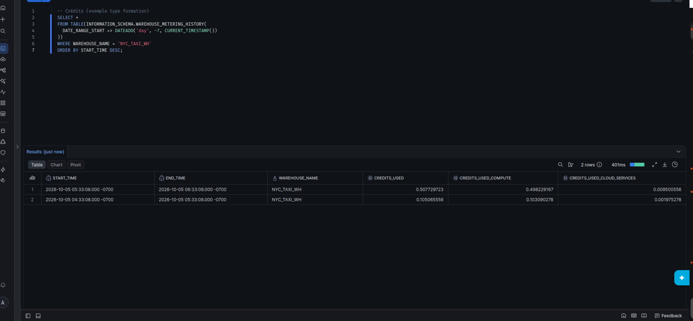

# Pipeline médaillon NYC Yellow Taxi — Snowflake & Airflow

Pipeline ELT qui charge les trajets Yellow Taxi TLC (jan–mars 2025) dans Snowflake, les transforme (RAW → STAGING → INTERMEDIATE → MARTS) via Airflow, et répond à la question métier d’Hudson Cab Partners.


## Résultat métier

Voir [`docs/REPONSE.md`](docs/REPONSE.md) : où / quand la demande est la plus forte, et combien rapporte un trajet.



## Architecture

| Couche | Rôle |
|---|---|
| **RAW** | Copie fidèle des Parquet / CSV + colonnes `_source_file`, `_loaded_at` |
| **STAGING** | Vues de renommage + tables de codes TLC |
| **INTERMEDIATE** | Trajets étiquetés (rejets) puis trajets valides enrichis |
| **MARTS** | Dimensions, `FCT_TRIPS`, marts demande / revenus / qualité |

Orchestration : DAG Airflow `chargement_yellow_taxi` (chargement + SQL + contrôles).

## Prérequis

```bash
bash verifier_poste.sh   # Python, Git, Docker, Astro CLI, OpenSSL → tout OK
```

- Compte Snowflake (essai OK)
- `uv` pour les scripts Python locaux (ou un venv)

## Relancer le projet (autre binôme)

### 1. Snowflake — infra + RAW

```bash
# Générer une paire de clés
mkdir -p ~/.ssh/snowflake && cd ~/.ssh/snowflake
openssl genrsa 2048 | openssl pkcs8 -topk8 -inform PEM -out rsa_key.p8 -nocrypt
openssl rsa -in rsa_key.p8 -pubout -out rsa_key.pub
chmod 600 rsa_key.p8
grep -v "BEGIN\|END" rsa_key.pub | tr -d '\n'; echo
```

1. Coller la clé publique dans `snowflake/01_infrastructure.sql` (`RSA_PUBLIC_KEY`)
2. **Run All** dans Snowsight (ACCOUNTADMIN / USERADMIN / SYSADMIN)
3. **Run All** de `snowflake/02_raw.sql` avec le rôle `TRANSFORMER`  
   Important : `USE_LOGICAL_TYPE = TRUE` sur le format Parquet (sinon timestamps absurdes)

```bash
cd ~/Documents/Projets/nyc-taxi-pipeline   # ou votre clone
export SNOWFLAKE_ACCOUNT='ORGANISATION-COMPTE'
uv sync
uv run python snowflake/test_connexion.py
# Attendu : ('AIRFLOW_SVC', 'TRANSFORMER', 'NYC_TAXI_WH')
```

### 2. Chargement manuel (jour 2)

```bash
export SNOWFLAKE_ACCOUNT='ORGANISATION-COMPTE'
uv run python ingestion/charger_mois.py 2025-01
uv run python ingestion/charger_zones.py
# Relancer janvier → 0 nouvelle ligne (idempotent)
```

### 3. Airflow

```bash
cd airflow
# Créer .env à partir de .env.example (clé privée sur une ligne, voir awk dans .env.example)
astro dev start
```

- Connexion : `snowflake_nyc_taxi`
- Activer le DAG `chargement_yellow_taxi` (**pas** Trigger)
- Catchup jan / fév / mars 2025

Tester la connexion : DAG `test_connexion_snowflake` (celui-là, Trigger OK).

## Résultats obtenus

| Table | Lignes |
|---|---:|
| `RAW.YELLOW_TRIPDATA` | 11 198 026 |
| `RAW.TAXI_ZONE_LOOKUP` | 265 |
| `INTERMEDIATE.INT_TRIPS__FLAGGED` | 11 198 026 |
| `MARTS.FCT_TRIPS` | 10 382 378 |
| `MARTS.MART_ZONE_HOURLY_DEMAND` | 11 524 |
| `MARTS.MART_DATA_QUALITY` | 18 |











## Contrôles qualité

| Fichier | Vérifie |
|---|---|
| `controles/raw_mois_charge.sql` | le mois est présent dans RAW |
| `controles/trop_de_rejets.sql` | &lt; 15 % de trajets écartés |
| `controles/trajets_sans_doublon.sql` | `trip_sk` unique après enrichissement |

Comparaison manuelle janvier : [`docs/CONTROLE_QUALITE.md`](docs/CONTROLE_QUALITE.md).

## Sécurité

- Utilisateur de service `AIRFLOW_SVC` (clé, pas de mot de passe)
- Rôle `TRANSFORMER` : RAW + staging/intermediate/marts uniquement
- Clé privée **jamais** dans Git (`.env`, `*.p8` ignorés)





## Structure du dépôt

```
.
├── ETAPES.md / CONTRAT_RAW.md     brief du cours
├── snowflake/                     infra + RAW + test connexion
├── ingestion/                     charger_mois.py, charger_zones.py
├── docs/                          fiches, réponse direction, captures
└── airflow/
    ├── dags/                      chargement_yellow_taxi + test_connexion
    ├── .env.example               modèle de connexion Snowflake
    └── include/sql/               transformations (fournies) + contrôles
```

## Paramètres du DAG

| Paramètre | Valeur |
|---|---|
| `max_trip_distance_miles` | 100 |
| `max_trip_duration_min` | 180 |
| `start_month` / `end_month` | 2025-01-01 / 2025-04-01 |
| `max_pct_rejetes` | 15 |

## Documentation utile

- [`docs/fiche_trajet.md`](docs/fiche_trajet.md) — fiche source
- [`docs/explorer_trajets.py`](docs/explorer_trajets.py) — exploration Parquet (`uv run python docs/explorer_trajets.py`)
- [`ETAPES.md`](ETAPES.md) — parcours en 5 jours
